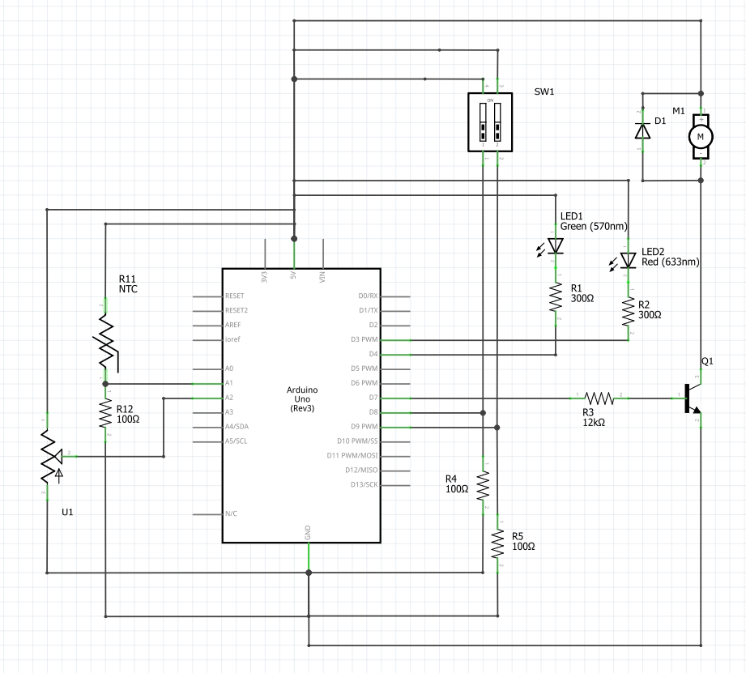

Krmiljenje ventilacije prostora

Ob vklopu stikala 1 naj se ventilacija vključi in obratno. Način delovanja ventilacije pa lahko izbiramo s stikalom 2, in sicer: AVTOMATSKO delovanje glede na višino temperature (višja temperatura - hitrejše vrtenje ventilatorja) ter ROČNO upravljanje z zveznim spreminjanjem hitrosti ventilatorja (s potenciometrom). Za preklop med avtomatskim in ročnim delovanjem uporabite stikalo 2; ob izklopu stikala 2 naj deluje ventilacija ročno, sicer pa avtomatsko. Poleg tega dodajte še LED diodi: Rdeča za signalizacijo ROČNO in zelena za AVTOMATSKO. Ob izklopu ventilacije se izklopita obe LED

Kosovnica :
- 1x motor
- 1x potenciometer
- žice
- 1x temperaturni senzor
- 1x dioda
- 2x LED dioda (ena zelena in ena rdeča)
- 1x tranzistor
- 6x uporov

Prvo stikalo vklopi/izklopi ventilacijo.
Drugo stikalo pa preklaplja med ročnim (rdeča) načinom in avtomatskim (zelena) načinom.

Nalogo bi lahko naredila bolje, če bi motorček, saj sem morala namesto njega uporabiti LED.
Če bi imela motorček, bi lahko dinamično spreminjala njegovo hitrost skozi analogne podatke, ki bi jih pridobili.

